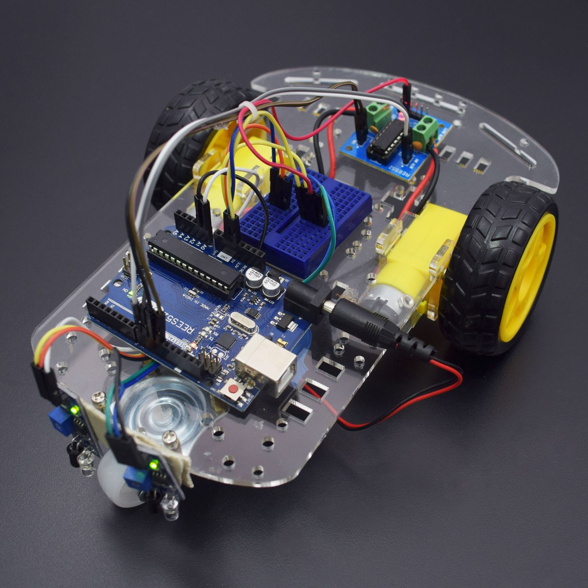

# BuggyRoboSoc
Software for buggy as part of RoboSoc project.

+ C++ based
+ Uses abstraction and encapsulation principles to allow advanding features

### Features
+ Check distance to object
+ Rotate distance sensor
+ Move forward, backward, left, and right
+ Turn to the closest object
+ Turn to the furthest object
+ Store recent actions in a stack based memory
+ Undo recent actions